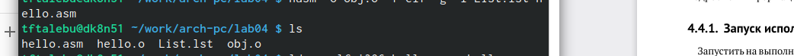

---
## Front matter
title: "Шаблон отчёта по лабораторной работе "
subtitle: "4"
author: "Талебу тенке франк устон , НКАбд-05-23"

## Generic otions
lang: ru-RU
toc-title: "Содержание"

## Bibliography
bibliography: bib/cite.bib
csl: pandoc/csl/gost-r-7-0-5-2008-numeric.csl

## Pdf output format
toc: true # Table of contents
toc-depth: 2
lof: true # List of figures
lot: true # List of tables
fontsize: 12pt
linestretch: 1.5
papersize: a4
documentclass: scrreprt
## I18n polyglossia
polyglossia-lang:
  name: russian
  options:
 - spelling=modern
 - babelshorthands=true
polyglossia-otherlangs:
  name: english
## I18n babel
babel-lang: russian
babel-otherlangs: english
## Fonts
mainfont: PT Serif
romanfont: PT Serif
sansfont: PT Sans
monofont: PT Mono
mainfontoptions: Ligatures=TeX
romanfontoptions: Ligatures=TeX
sansfontoptions: Ligatures=TeX,Scale=MatchLowercase
monofontoptions: Scale=MatchLowercase,Scale=0.9
## Biblatex
biblatex: true
biblio-style: "gost-numeric"
biblatexoptions:
  - parentracker=true
  - backend=biber
  - hyperref=auto
  - language=auto
  - autolang=other*
  - citestyle=gost-numeric
## Pandoc-crossref LaTeX customization
figureTitle: "Рис."
tableTitle: "Таблица"
listingTitle: "Листинг"
lofTitle: "Список иллюстраций"
lotTitle: "Список таблиц"
lolTitle: "Листинги"
## Misc options
indent: true
header-includes:
  - \usepackage{indentfirst}
  - \usepackage{float} # keep figures where there are in the text
  - \floatplacement{figure}{H} # keep figures where there are in the text
---

# Цель работы

- Цель данной лабораторной работы - освоить процедуры компиляции и сборки программ, написанных на ассемблере NASM.

# Выполнение лабораторной работы

- 1) Создание программы Hello world!

- С помощью утилиты cd перемещаюсь в каталог, в котором буду работать (рис. @fig:001).

{#fig:001 width=100%}
======= 
- Создаю в текущем каталоге пустой текстовый файл hello.asm с помощью утилиты touch (рис. @fig:002).

{#fig:002 width=100%}

- Открываю созданный файл в текстовом редакторе gedig hello.asm (рис. @fig:003).

{#fig:003 width=100%}

- Заполняю файл, вставляя в него программу для вывода "Hello word!" (рис. @fig:004).
{#fig:004 width=100%}

- 2) Работа с транслятором NASM и pабота с расширенным синтаксисом командной строки NASM

- Превращаю текст программы для вывода "Hello world!" в объектный код с помощью транслятора NASM, используя команду nasm -f elf hello.asm, ключ -f указывает транслятору nasm, что требуется создать бинарный файл в формате ELF (рис. [@fig:006]). Далее проверяю правильность выполнения команды с помощью утилиты ls: действительно, создан файл "hello.o". Ввожу команду, которая скомпилирует файл hello.asm в файл obj.o, при этом в файл будут включены символы для отладки (ключ -g), также с помощью ключа -l будет создан файл листинга list.lst (рис. [@fig:006]). Далее проверяю с помощью утилиты ls правильность выполнения команды.(рис. @fig:005).

{#fig:006 width=100%}

- 3) Работа с компоновщиком LD

- Передаю объектный файл hello.o на обработку компоновщику LD, чтобы получить исполняемый файл hello (рис. [@fig:007]). Ключ -о задает имя создаваемого исполняемого файла. Далее проверяю с помощью утилиты ls правильность выполнения команды.Выполняю следующую команду (рис. [@fig:007]). Исполняемый файл будет иметь имя main, т.к. после ключа -о было задано значение main. Объектный файл, из которого собран этот исполняемый файл, имеет имя obj.o. (рис. @fig:007).

{#fig:007 width=100%}

- 4) Запуск исполняемого файла

- Запускаю на выполнение созданный исполняемый файл hello (рис. @fig:009).
{#fig:009 width=100%}

# Выполнение заданий для самостоятельной работы.
 
- С помощью утилиты cp создаю в текущем каталоге копию файла hello.asm с именем lab4.asm (рис. @fig:010).

{#fig:010 width=100%}

- С помощью текстового редактора gedit открываю файл lab4.asm и вношу изменения в программу так, чтобы она выводила мои имя и фамилию.(рис. @fig:011).

{#fig:011 width=100%}

- Компилирую текст программы в объектный файл (рис. [@fig:012]). Проверяю с помощью утилиты ls, что файл lab4.o создан. (рис. @fig:012).

{#fig:012 width=100%}

- Передаю объектный файл lab4.o на обработку компоновщику LD, чтобы получить исполняемый файл lab4 (рис. @fig:013).

{#fig:013 width=100%}

# Выводы

- При выполнении данной лабораторной работы я освоила процедуры компиляции и сборки программ, написанных на ассемблере NASM

# Список литературы{.unnumbered}

- ::: {#refs} :::

